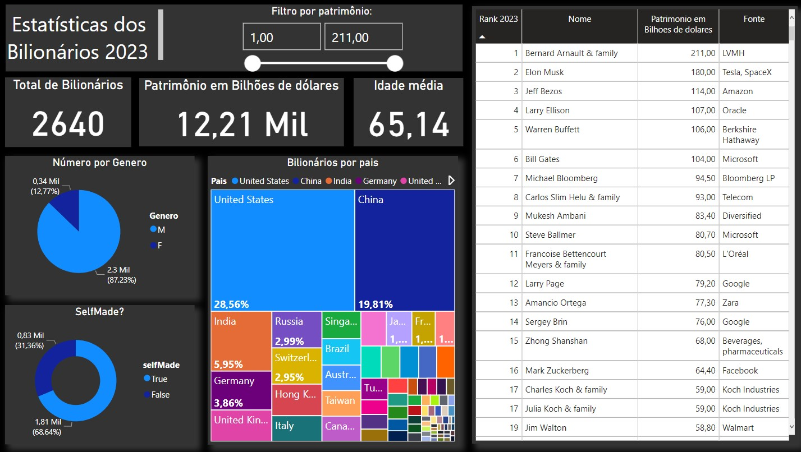

# Visão Geral:

Dashboard construido no Power BI Desktop, com objetivo principal de demonstrar um pouco do meu conhecimento utilizando essa ferramenta. Ele traz dados dos maiores bilionários de 2023 como, fortuna, self-made ou não, principal setor de atuação, nacionalidade, idade, nome, etc. 

Com esses dados podemos tirar algumas informações úteis e curiosas sobre as pessoas mais ricas do mundo, como por exemplo: 

- Ao somar o patrimônio dos 2640 bilionários da lista, surpreendentemente alcançamos quase 50% do PIB dos EUA em 2022;
- Os 20% dos mais ricos dessa lista detém mais de 60% do patrimônio total entre eles;
- Idade média dos mais ricos;
- Principais setores de atuação (tecnolgia, automotivo, etc).

## Fonte dos dados:

A base de dados foram retiradas do [Kaggle](https://www.kaggle.com/). 

## Print do dashboard:

## Como visualizar o dashboard na sua máquina (editar e interagir):

1. Baixe os arquivos desse repositório;
2. Baixe o [Power BI Desktop](https://powerbi.microsoft.com/pt-br/desktop/) OBS: recomendo que baixe o setup e não pela Microsoft Store;
3. Abra o arquivo bilionarios.pbxi.